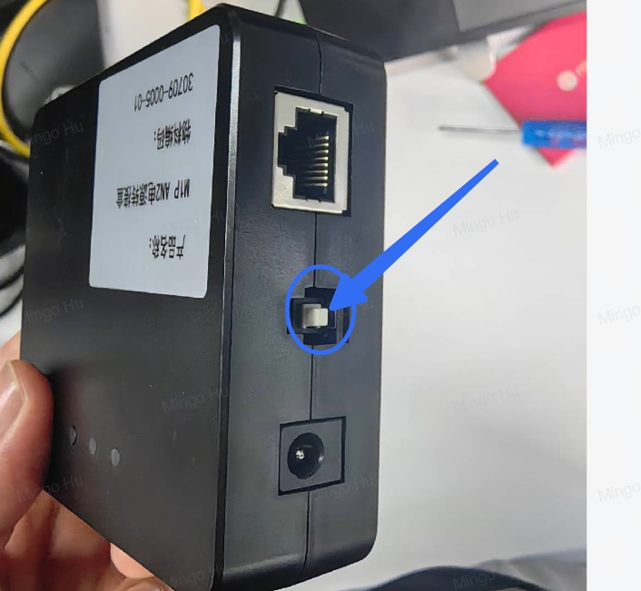
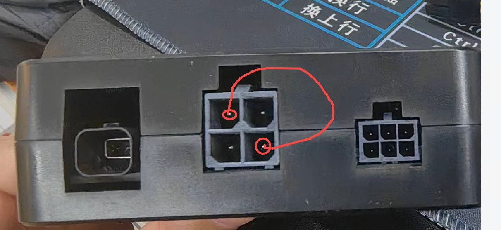
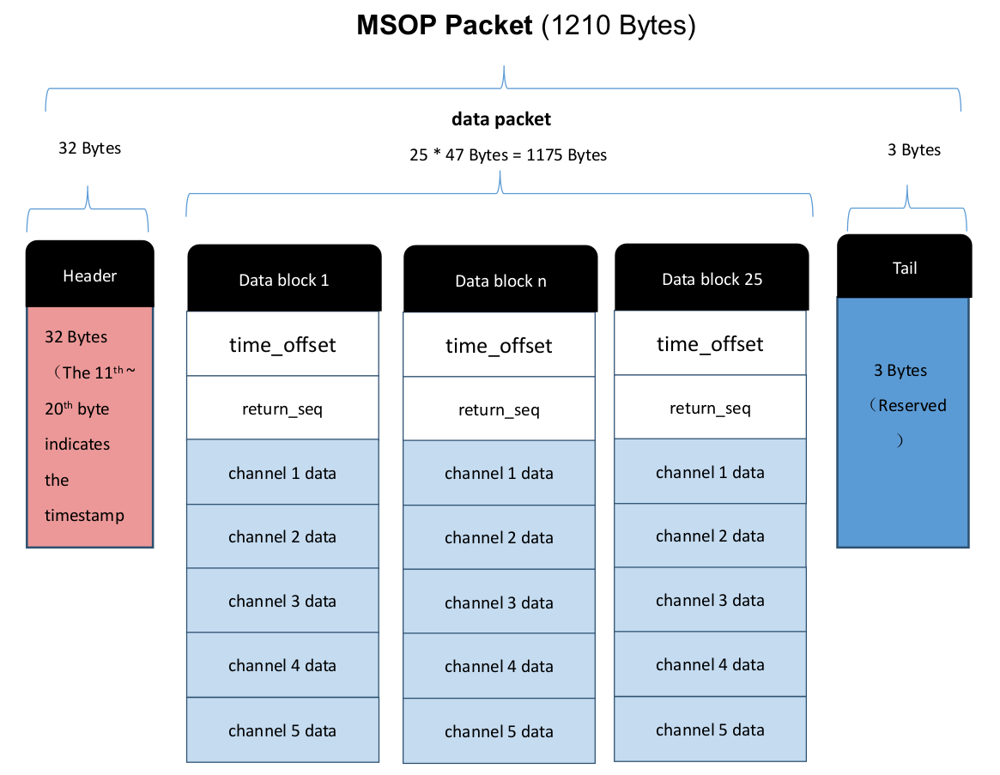
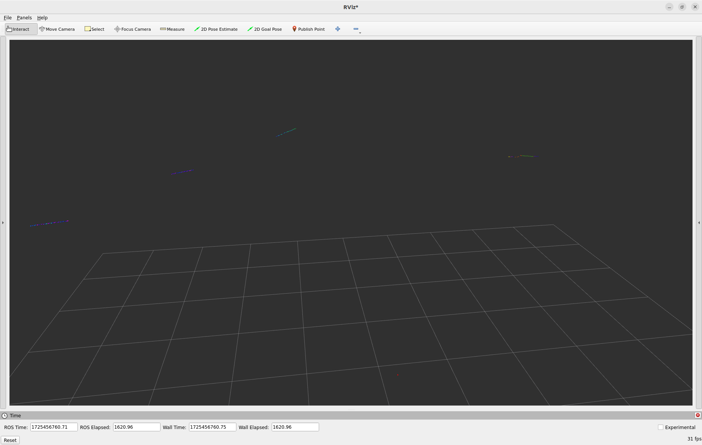
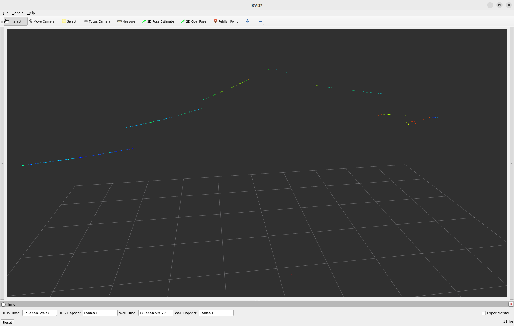
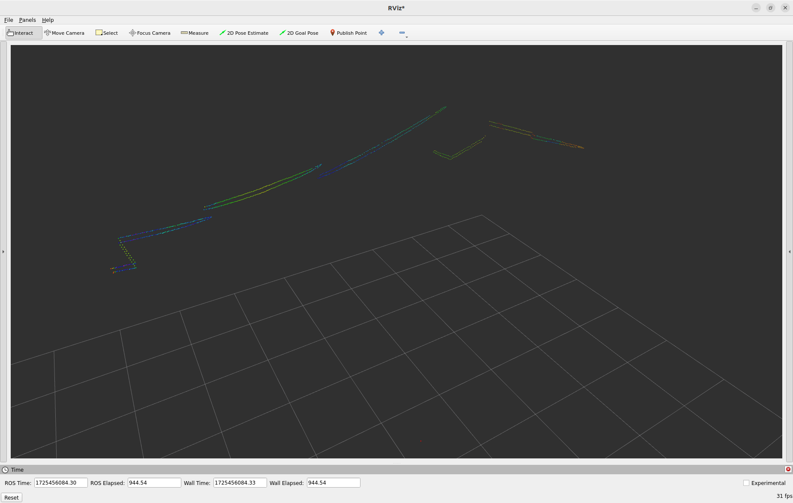
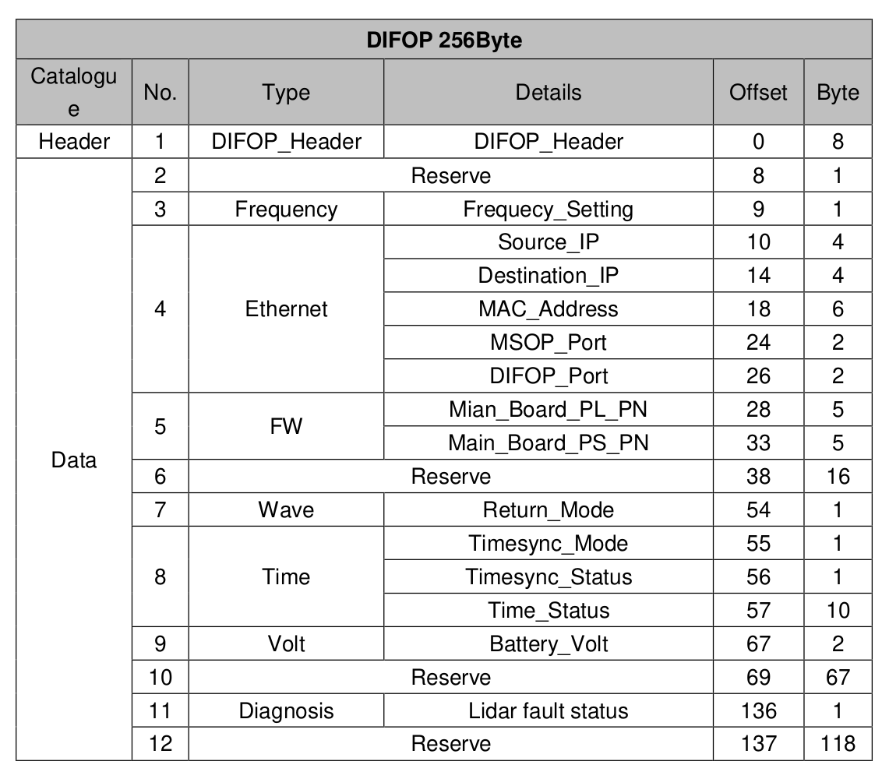

# Robosense M1 Plus Driver

Robosense M1 Plus Driver based on [Robot Operating System 2](https://docs.ros.org/en/humble/index.html) robotics middleware.

## Table of contents

- [Robosense M1 Plus Driver](#robosense-m1-plus-driver)
  - [Table of contents](#table-of-contents)
  - [Hardware](#hardware)
  - [Requirements](#requirements)
  - [Features](#features)
    - [LiDAR Supported](#lidar-supported)
    - [Point Type Supported](#point-type-supported)
  - [Datasheet](#datasheet)
    - [Product Specifications](#product-specifications)
    - [Communication Protocol](#communication-protocol)
    - [MSOP Packets](#msop-packets)
      - [Point cloud elaboration](#point-cloud-elaboration)
      - [Point cloud organization](#point-cloud-organization)
    - [DIFOP Packets](#difop-packets)
  - [Usage](#usage)
    - [Build options](#build-options)
    - [Node parameters](#node-parameters)
  - [Feedback](#feedback)
  - [License](#license)
  - [Copyright](#copyright)

## Hardware

If you are using an M1 Plus as LiDAR and you have the hub for this LiDAR, you have to press down the wake-up button:



If you are using an M1 Plus as LiDAR but you have the hub for a M1 LiDAR, you can do the following electrical short circuit to make them work:



## Requirements

- **ROS 2**
- **Robosense M1 Plus Interfaces** (https://github.com/IntelligentSystemsLabUTV/robosense_m1plus_interfaces.git)

## Features

- `PointCloud2` topic for MSOP (Main Data Stream Output) data with the following fields: x, y, z, intensity, ring and time.
- `DIFOP` topic for DIFOP (LiDAR Information Output Protocol) data with the following fields: header, frequency_setting, source_ip, destination_ip, mac_address, msop_port, difop_port, main_board_pl_pn, main_board_ps_pn, return_mode, timesync_mode, timesync_status, time_status, battery_volt and lidar_fault_status.
- Single return mode only.
- ROS 2 component compilation and installation.
- Optimized memory handling.
- Offers both reliable and best-effort QoS profiles, configurable via node parameters.

### LiDAR Supported

- RS-LiDAR-M1
- RS-LiDAR-M1P

### Point Type Supported

- XYZIRT - x, y, z, intensity, ring, time

## Datasheet

In the main directory there is the file `Datasheet.pdf`, which explains how the LiDAR Robosense M1 Plus works.

### Product Specifications

- `Sensor`:
  - `Time of flight (TOF)`: ranging with reflection intensity value.
  - `Ranging distance`: 0.5m ~200m(180m@10%).
  - `Ranging precision`: ± 5cm@1.
  - `Field of view (FOV) vertical`: 25° (-12.5°~+12.5°).
  - `Angular vertical resolution`: 0.2°.
  - `Field of view (FOV) horizontal`: 120° (-60.0°~+60.0°).
  - `Angular horizontal resolution`: 0.2°.
  - `Frame rate`: 10 Hz.
- `Laser`:
  - `Class 1`: eye safe.
  - `Wavelength`: Eye safe.
- `Output`:
  - `Points/second`: 787,500.
  - `Packets`: UDP.
- `Electronics`:
  - `Power consumption`: 15w.
  - `Working voltage`: 9~16V DC
- `Mechanics`:
  - `Weight`: 0.75kg.
  - `Operating temperature range`: -40°C~85°C.

### Communication Protocol

The communication between RS-LiDAR-M1P and the computer is through Ethernet, and uses UDP protocol. There are two types of output packets:

- `MSOP (Main Data Stream Output)` packet (1210 bytes) sent to the Port Number `6699`.
- `DIFOP (LiDAR Information Output Protocol)` packet (256 bytes) sent to the Port Number `7788`.

The network parameters are the following:

- LiDAR's default IP Address:
  - The default is `192.168.1.200`.
- Computer's IP Address:
  - Has to be set as `192.168.1.102`.
- Computer's Subnet Mask:
  - Has to be set as `255.255.255.0`.

### MSOP Packets

Every MSOP packet has the following basic structure:



In this driver, there are used the following bytes:

- `Header (32 bytes)`:
  - `pkt_header`: can be used as a packet inspection sequence.
    - identification header: `0x55, 0xaa, 0x5a, 0xa5`.
    - Offset: 0 byte.
    - Length: 4 bytes.
  - `pkt_psn`: Packets Sequence Number with packet counting in a circular counting manner.
    - The count value of the first data packet of each frame is 1.
    - The count value of the last data packet of each frame is 630.
    - Offset: 4 bytes.
    - Length: 2 bytes.
  - `timestamp`: store timestamps.
    - Offset: 10 bytes.
    - Length: 10 bytes.
    - High 6 bytes: second bits.
    - Low 4 bytes: microsecond bits.

      ```c++
      // Get the time from the pc clock
      double timestamp_header = static_cast<double>(this->get_clock()->now().seconds());
      // Get the time from the lidar clock
      if (use_lidar_timer_)
      {
          uint64_t seconds = 0;
          for (size_t i = 0; i < LENGTH_SEC; ++i)
          {
              seconds = (seconds << 8) | header_ptr[OFFSET_SEC + i];
          }
          uint32_t microseconds = 0;
          for (size_t i = 0; i < LENGTH_MSEC; ++i)
          {
              microseconds = (microseconds << 8) | header_ptr[OFFSET_MSEC + i];
          }
          timestamp_header = static_cast<double>(seconds) + static_cast<double>(microseconds) * 1e-6;
      }
      ```

For processing the N data blocks after the header, is used a double for loop (one for channel_idx and one for the block_idx):

```c++
for (size_t channel_idx = 0; channel_idx < NUM_CHANNELS; ++channel_idx)
{
    for (size_t block_idx = 0; block_idx < NUM_BLOCKS; ++block_idx)
    {
        const uint8_t* block_ptr = header_ptr + HEADER_MSOP + block_idx * SIZE_BLOCKS;
        size_t offset = channel_idx * SIZE_CHANNELS;

        // elaborate data
    }
}
```

- `Data block N (47 bytes)`:
  - `time_offset`: time offset of all points in the block relative to the timestamp of the packet.
    - Offset: 0 byte.
    - Length: 1 byte.

      ```c++
      uint8_t time_offset = block_ptr[offset];
      ```

  - `chk_radius`: in the polar coordinate system, the radial distance value of the channel k points, the distance resolution is 5mm.
    - Offset: 2 + channel_idx * 9 bytes.
    - Length: 2 bytes.

      ```c++
      float radius = ((block_ptr[offset + OFFSET_RADIUS] << 8) | block_ptr[offset + (OFFSET_RADIUS + 1)]) * RESOLUTION_METERS;
      ```

  - `chk_elevation`: in the polar coordinate system, the vertical angle of the channel k points, the resolution is 0.01° (-12.5°~+12.5°).
    - Offset: 4 + channel_idx * 9 bytes.
    - Length: 2 bytes.

      ```c++
      float elevation = (((block_ptr[offset + OFFSET_ELEVATION] << 8) | block_ptr[offset + (OFFSET_ELEVATION + 1)]) - OFFSET_CENTRAL) * RESOLUTION_DEGREES;
      ```

  - `chk_azimuth`: in the polar coordinate system, the horizontal angle of the channel k points, the resolution is 0.01° (-12.5°~+12.5°).
    - Offset: 6 + channel_idx * 9 bytes.
    - Length: 2 bytes.

      ```c++
      float azimuth = (((block_ptr[offset + OFFSET_AZIMUTH] << 8) | block_ptr[offset + (OFFSET_AZIMUTH + 1)]) - OFFSET_CENTRAL) * RESOLUTION_DEGREES;
      ```

  - `chk_intensity`: Reflection intensity value of the channel k points, the value range is 0~255.
    - Offset:
    - Length: 1 byte.

      ```c++
      float intensity = static_cast<float>(block_ptr[offset + OFFSET_INTENSITY]);
      ```

#### Point cloud elaboration

Each point of the point cloud is obtained using the following formulas:

- `x`:

  ```c++
  float x = start_x_ + radius * cosf(elevation * M_PI / 180.0f) * cosf(azimuth * M_PI / 180.0f);
  ```

- `y`:

  ```c++
  float y = start_y_ + radius * cosf(elevation * M_PI / 180.0f) * sinf(azimuth * M_PI / 180.0f);
  ```

- `z`:

  ```c++
  float z = start_z_ + radius * sinf(elevation * M_PI / 180.0f);
  ```

- `intensity`:

  ```c++
  float intensity = static_cast<float>(block_ptr[offset + OFFSET_INTENSITY]);
  ```

- `ring`:

  ```c++
  uint16_t ring = (HEIGHT - 1) - message_ring_count;
  ```

- `time`:

  ```c++
  double timestamp_point = timestamp_header + static_cast<double>(time_offset) * 1e-6;
  ```

#### Point cloud organization

- Height = 126 rings.
- Width = 625 points.

Every packet is organized as it follows:

- 5 channels.
- 25 points per channel.
- 125 points per packet.

A ring is composed by 5 following packets with this structure:

Packet 1: |block----------------|block----------------|block----------------|block----------------|block----------------|
Packet 2: |----block------------|----block------------|----block------------|----block------------|----block------------|
Packet 3: |--------block--------|--------block--------|--------block--------|--------block--------|--------block--------|
Packet 4: |------------block----|------------block----|------------block----|------------block----|------------block----|
Packet 5: |----------------block|----------------block|----------------block|----------------block|----------------block|

Here an example:

The first packet is organized as it follows:



To complete the first ring, is necessary to process the first 5 packets:



To complete the first and second ring, is necessary to process the first 10 packets:



And so on.

To save the sorted point cloud, has been used the following formula for finding the correct offset:

```c++
  uint8_t* ptr = point_cloud_msg_.data.data() + (block_idx + message_count * POINTS_PER_BLOCK + channel_idx * POINTS_PER_MESSAGE + message_ring_count * POINTS_PER_RING) * point_cloud_msg_.point_step;
```

And then each point has been saved properly, with its fields:

```c++
memcpy(ptr, &x, sizeof(float));
memcpy(ptr + 4, &y, sizeof(float));
memcpy(ptr + 8, &z, sizeof(float));
memcpy(ptr + 12, &intensity, sizeof(float));
memcpy(ptr + 16, &ring, sizeof(uint16_t));
memcpy(ptr + 20, &timestamp_point, sizeof(double));
```

At the end of the processing of each single packet, the variables are modified as follows to make the offset's formula work:

```c++
packet_count++;
message_count++;

if (packet_count % 5 == 0)
{
    message_count = 0;
    message_ring_count++;
}
```

### DIFOP Packets

Every DIFOP packet has the following basic structure:



For publishing this informations, has been created a personalized ROS 2 message `robosense_m1plus_interfaces/DIFOP.msg`:

```c++
uint8[8] header
uint8 frequency_setting
uint32 source_ip
uint32 destination_ip
uint8[6] mac_address
uint16 msop_port
uint16 difop_port
uint8[5] main_board_pl_pn
uint8[5] main_board_ps_pn
uint8 return_mode
uint8 timesync_mode
uint8 timesync_status
uint8[10] time_status
uint16 battery_volt
uint8 lidar_fault_status
```

```c++
auto message = robosense_m1plus_interfaces::msg::DIFOP();
```

In this driver, there are used the following bytes:

- `Header (8 bytes)`:
  - `pkt_header`: can be used as a packet inspection sequence.
    - identification header: `0xa5, 0xff, 0x00, 0x5a, 0x11,0x11,0x55, 0x55`.
    - Offset: 0 byte.
    - Length: 8 bytes.

  ```c++
  memcpy(message.header.begin(), buffer, HEADER_DIFOP);
  ```

- `Frequency setting`:
  - Offset: 9 bytes.
  - Length: 1 byte.

  ```c++
  message.frequency_setting = buffer[OFFSET_FREQUENCY];
  ```

- `Source IP`:
  - Offset: 10.
  - Length: 4.

  ```c++
  uint32_t source_ip;
  memcpy(&source_ip, buffer + OFFSET_SOURCE_IP, LENGTH_SOURCE_IP);
  source_ip = ntohl(source_ip);
  message.source_ip = source_ip;
  ```

- `Destination IP`:
  - Offset: 14.
  - Length: 4.

  ```c++
  uint32_t destination_ip;
  memcpy(&destination_ip, buffer + OFFSET_DEST_IP, LENGTH_DEST_IP);
  destination_ip = ntohl(destination_ip);
  message.destination_ip = destination_ip;
  ```

- `MAC Address`:
  - Offset: 18.
  - Length: 6.

  ```c++
  std::copy(buffer + OFFSET_MAC_ADDR, buffer + OFFSET_MAC_ADDR + LENGTH_MAC_ADDR, message.mac_address.begin());
  ```

- `MSOP Port`:
  - Offset: 24.
  - Length: 2.

  ```c++
  uint16_t msop_port;
  memcpy(&msop_port, buffer + OFFSET_MSOP_PORT, LENGTH_MSOP_PORT);
  msop_port = ntohs(msop_port);
  message.msop_port = msop_port;
  ```

- `DIFOP Port`:
  - Offset: 26.
  - Length: 2.

  ```c++
  uint16_t difop_port;
  memcpy(&difop_port, buffer + OFFSET_DIFOP_PORT, LENGTH_DIFOP_PORT);
  difop_port = ntohs(difop_port);
  message.difop_port = difop_port;
  ```

- `Main Board PL PN`:
  - Offset: 28.
  - Length: 5.

  ```c++
  std::copy(buffer + OFFSET_PL_PN, buffer + OFFSET_PL_PN + LENGTH_PL_PN, message.main_board_pl_pn.begin());
  ```

- `Main Board PS PN`:
  - Offset: 33.
  - Length: 5.

  ```c++
  std::copy(buffer + OFFSET_PS_PN, buffer + OFFSET_PS_PN + LENGTH_PS_PN, message.main_board_ps_pn.begin());
  ```

- `Return Mode`:
  - Offset: 54.
  - Length: 1.

  ```c++
  message.return_mode = buffer[OFFSET_RETURN_MODE];
  ```

- `Timesync Mode`:
  - Offset: 55.
  - Length: 1.

  ```c++
  message.timesync_mode = buffer[OFFSET_SYNC_MODE];
  ```

- `Timesync Status`:
  - Offset: 56.
  - Length: 1.

  ```c++
  message.timesync_status = buffer[OFFSET_SYNC_STATUS];
  ```

- `Time Status`:
  - Offset: 57.
  - Length: 10.

  ```c++
  std::copy(buffer + OFFSET_TIME_STATUS, buffer + OFFSET_TIME_STATUS + LENGTH_TIME_STATUS, message.time_status.begin());
  ```

- `Battery Volt`:
  - Offset: 67.
  - Length: 2.

  ```c++
  uint16_t battery_volt;
  memcpy(&battery_volt, buffer + OFFSET_BATTERY_VOLT, LENGTH_BATTERY_VOLT);
  battery_volt = ntohs(battery_volt);
  message.battery_volt = battery_volt;
  ```

- `LiDAR Fault Status`:
  - Offset: 136.
  - Length: 1.

  ```c++
  message.lidar_fault_status = buffer[OFFSET_FAULT_STATUS];
  ```

## Usage

The code compiles to a standalone ROS 2 application executable that can be run easily. There is also a launch file for working with parameters.

You can use `RViz` to display the frames being streamed:

- `Fixed Frame` in `Global Options` must be set appropriately, and a transform from the lidar frame to the fixed frame must be available.

### Build options

The build process is automatic, using:

```bash
colcon build --symlink-install --packages-up-to robosense_m1plus_driver
```

### Node parameters

Configuration files for node parameters can be found in `config`, with some standard default settings. They can be customized, or overridden from command line or launch files.

- `ros_frame_id:`: id of the lidar link, defaults to `rslidar`.
- `ros_send_point_cloud_topic:`: name of the point cloud topic, defaults to `rslidar_points`.
- `ros_send_difop_topic:`: name of the DIFOP topic, defaults to `difop`.
- `start_x:`: initial offset for the point cloud on the X-axis, defaults to `0.0`.
- `start_y:`: initial offset for the point cloud on the Y-axis, defaults to `0.0`.
- `start_z:`: initial offset for the point cloud on the Z-axis, defaults to `0.0`.
- `publish_difop:`: flag for publishing DIFOP messages, defaults to `true`.
- `use_lidar_timer:`: flag for using the LiDAR timer, defaults to `false`.

Keep in mind that:

- Before using the LiDAR timer, it has to be synchronized.
- The initial offsets for the point cloud are useful for visualizing it on `RViz`, but set them at their defaults if your algorithm is using the `TFs` for transforming them.

See the [`params.yaml`](src/robosense_m1plus_driver/params/params.yaml) file for more information.

## Feedback

If you have any questions or suggestions, please open an issue or contact us here on GitHub.

---

## License

This work is licensed under the GNU General Public License v3.0. See the [`LICENSE`](LICENSE) file for details.

## Copyright

Copyright (c) 2024, Intelligent Systems Lab, University of Rome Tor Vergata
